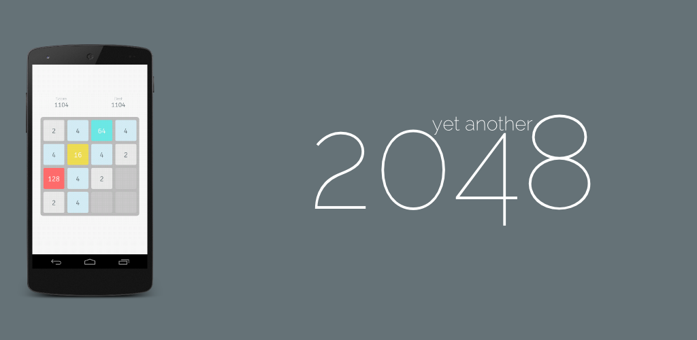

Yet Another 2048
====

This is a clone of popular game [2048](http://gabrielecirulli.github.io/2048/), re-written for mobile using [Game Closure](http://gameclosure.com/)

Screenshot
----



How To Build
----
1. Install Devkit Tool
```
npm install -g https://github.com/hashcube/devkit
```
2. Install dependencies
```
devkit install
```
3. Build
```
devit debug native-android
// or
devit release native-android
```

Resources
----
Sounds:
- RPG sounds by [Kenney Vleugels](http://kenney.nl), CC0

Images:
- [Reload](http://thenounproject.com/term/reload/30351/) by Grant Fisher from The Noun Project, CC
- [Medal](http://thenounproject.com/term/medal/13720/) by Vivian Ziereisen from The Noun Project, CC
- [Trophy](http://thenounproject.com/term/trophy/17975/) by thiyagu from The Noun Project, CC
- [Diagram](http://thenounproject.com/term/diagram/23497/) by Juan Pablo Bravo from The Noun Project, CC
- [Play](http://thenounproject.com/term/play/6506/) by Mateo Zlatar from The Noun Project, CC
- [Gear](http://thenounproject.com/term/gear/25723/) by Casey Speer from The Noun Project, CC
- [Stopwatch](http://thenounproject.com/term/stopwatch/27551/) by Ryan Dell from The Noun Project, CC
- [Mortar Board](http://thenounproject.com/term/mortar-board/11937/) by Stephen JB Thomas from The Noun Project, CC
